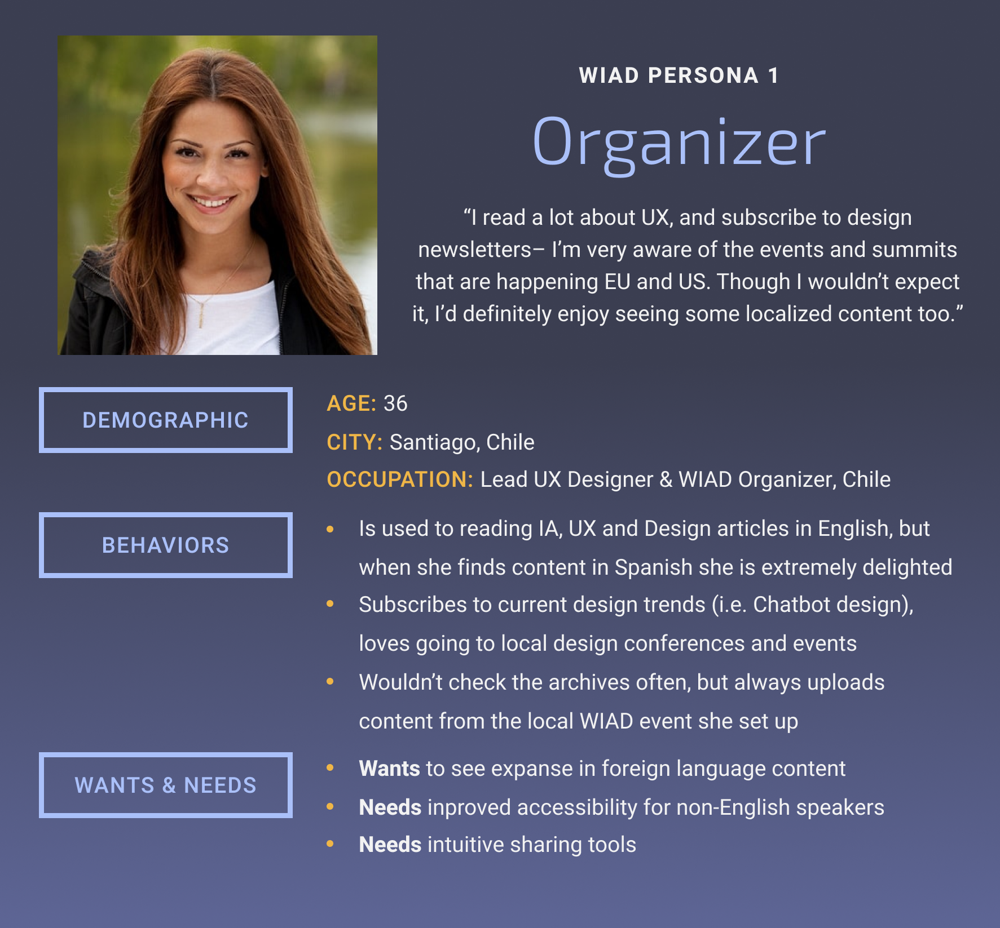
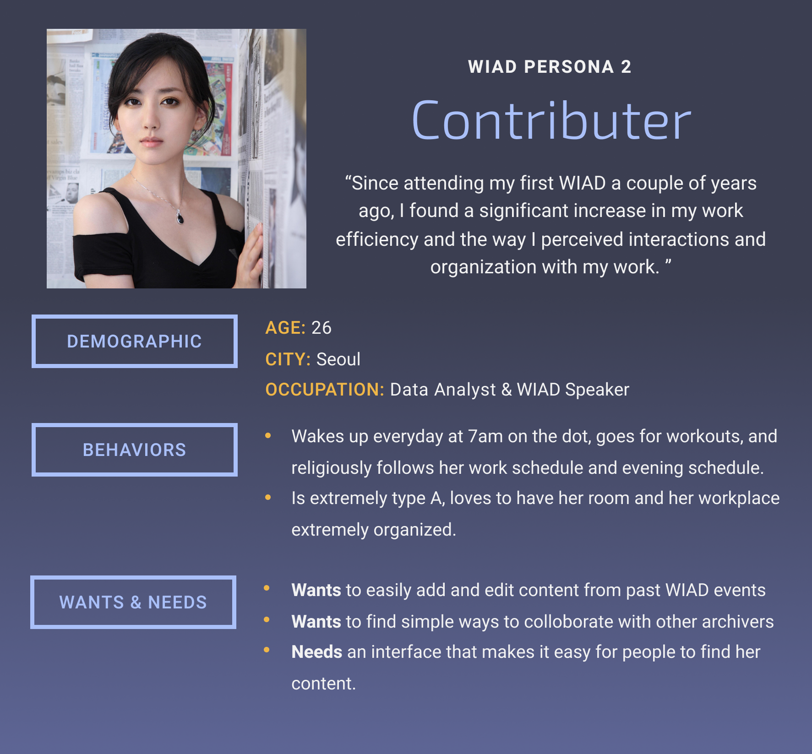

# WIAD Personas
User research conducted around WIAD users, including local organizers (new and repeat), attendees (veterans and students), sponsors

## Executive Summary
A group of UCLA students taking a User Experience Design class were tasked with conducting user research in order to create a taxonomy for WIAD's video content on the website. The group made personas in order to assist their decisions when it came down to suggesting the new taxonomy, which are shown and desribed here. 
 
The timeframe for this project was ten weeks between April and June, 2018. Miguel, the team's project manager, will continue research for WIAD for the next upcoming year. However, these foundations for research would not have been possible without the efforts of the UCLA team: special thanks to Jade Bisht, Rohan Kumar, Javier Salas, Gaby Chan, Matt Fang, and Jill Tiutan.

## Personas
These personas would be helpful in ensuring our design decisions could adequately serve the wants and needs of our users. We have a total of four personas, with two distinct categories: prospective users and WIAD affiliate users. 

### Prospective Users
These two personas represent users who are not currently using the WIAD archive, but show interest in doing so. These are key personas to focus on, as a positive experience with the WIAD archive could encourage the user to participate in future WIAD events and join their local IA community.

[Professional](professional.md)

[Noobert](noobert.md)

### WIAD AFFILIATE PERSONAS
These two personas demonstrate the goals and frustrations of those already using the WIAD archive. As contributors, however, their interests and concerns are quite different than those of the prospective users. Nonetheless, we felt that the WIAD archive was going to serve both IA practitioners and the IA-curious alike, and the wants and needs of those already using the site should be heard.

Description:
Her chief agenda for the WIAD archive is explicitly social and community-based. For her, this site should be welcoming and usable by anyone who comes across it, no matter their location, personal background or skill level. Ultimately, she finds joy in bringing people together and is excited for WIAD’s potential to spark conversations both locally and globally.

This affiliate, on the other hand, also sees the WIAD archive as a social tool, but as an avid content contributor, she wants her material to be easily findable. If she tells her colleague of her recent WIAD presentation, it should be quick and easy to find. Additionally, she wants for the process of uploading and editing to be streamline and simple to do.

## Contirbute
Work on improving the usibilty of the WIAD website and its constituent parts are being worked on by Miguel Gutierrez, research@worldiaday.org

Should you wish to contribute to research as an interviewee or have feedback, please feel to reach out to him.
