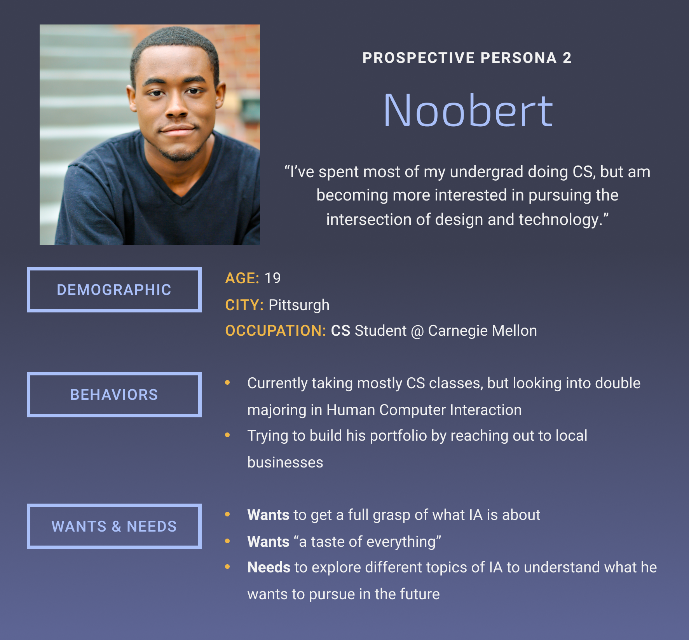

# Noobert

Source:
Jade and Gaby's cardsorting activity/interviews with students who have an interest in IA.

Description:
Noobert, too, is not necessarily a WIAD attendee, but he is interested in the conversations of the IA community. As a student, Noobert is trying to figure out what he likes and what he wants to do, but feels drawn to IA. He is by no means fluent in the trends, concerns, or discourses of technology professionals, but is eager to learn.
