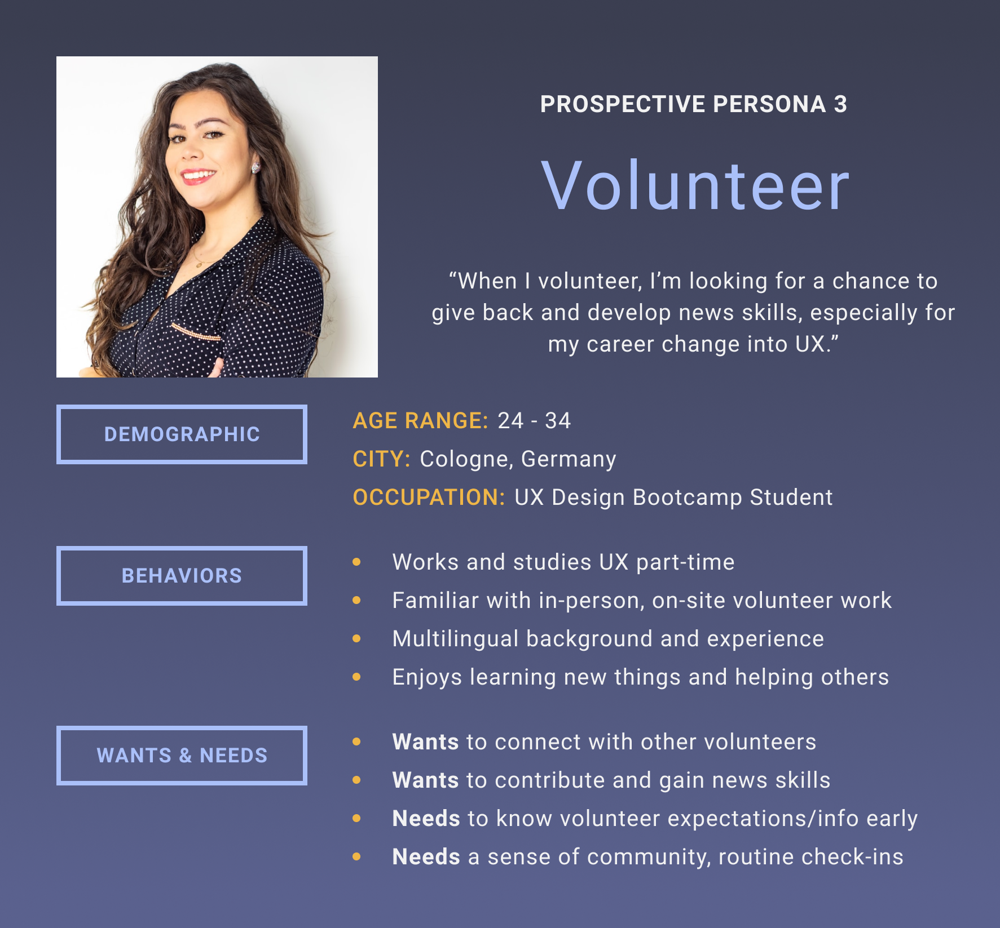

# Volunteer

Source:
Amanda’s user interviews with UXD bootcamp students for a previous WIAD Volunteer Onboarding project from March - May 2021 with Grace Lau.

Description:
Volunteer likely hasn’t heard of World IA Day but is looking for a meaningful opportunity to volunteer and expand their skillset in UX. They need to understand what’s expected of them as a volunteer and appreciate a sense of connectedness, which includes knowing who to go to for questions, having routine check-ins with their assigned mentor or manager, and meeting other volunteers.
